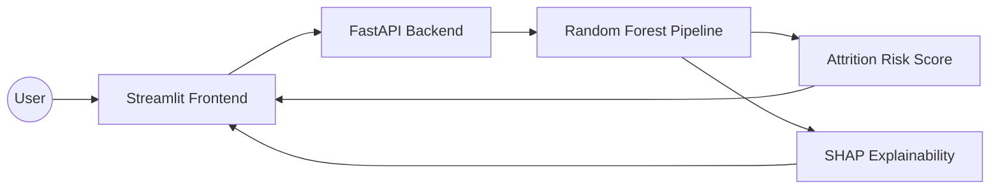

<!-- HEADER -->
<div align="center">


</div>

# 🌍 Green Destinations Employee Attrition Analysis

> **Production-Ready ML System** for predicting employee turnover with high recall and model explainability (SHAP).


---

## 🛑 Problem Statement

Employee attrition is a critical challenge for modern businesses. High turnover rates not only incur significant recruitment and training costs but also disrupt team productivity. This project delivers a **Strategic HR Intelligence System** that doesn't just predict "who" might leave, but explains **"why"** using Explainable AI (SHAP), allowing for targeted interventions.

---

## 🏗️ System Architecture

This project has been evolved from a simple notebook into a modular, production-grade architecture:



- **Backend (FastAPI):** A high-performance REST API for model serving.
- **Frontend (Streamlit):** An interactive dashboard for HR managers to perform "What-If" analysis.
- **ML Pipeline:** Robust preprocessing with `ColumnTransformer` and `ImbPipeline` to prevent data leakage.
- **Explainable AI (XAI):** Integrated SHAP plots to provide prediction transparency.

---

## 📊 Model Performance

We implemented a **Random Forest Classifier** optimized via a threshold search to prioritize **Recall**.

| Metric | Score | Note |
| :--- | :---: | :--- |
| **ROC-AUC** | **0.801** | Strong discriminative power |
| **Recall (Leaving Class)** | **0.66** | Optimized to catch 66% of leavers |
| **Precision** | **0.40** | Focused on coverage over exactness |
| **F1-Score** | **0.50** | Balanced for imbalanced classes |

✅ **Optimization:** We tuned the classification threshold to **0.3** (down from 0.5) to minimize **False Negatives**, ensuring fewer at-risk employees are missed by HR.

---

## 🚀 API Usage (Production Serving)

The model is served via a **FastAPI** microservice.

**Endpoint:** `POST /predict`

**Example Request:**
```json
{
  "Age": 30,
  "MonthlyIncome": 5000,
  "OverTime": "Yes",
  "TotalWorkingYears": 5,
  "YearsAtCompany": 2,
  "Department": "Sales",
  "JobRole": "Sales Executive"
}
```

**Example Response:**
```json
{
  "attrition_probability": 0.72,
  "risk_level": "High",
  "recommendation": "Urgent Stay Interview recommended"
}
```

---

## 📊 Dataset & Features

The analysis is based on a comprehensive HR dataset containing **1,470 employee records**.

- **File:** `data/greendestination (1) (1).csv`
- **Key Engineered Features:**
  - `IncomePerAge`: Monthly income normalized by age.
  - `TenureRatio`: Ratio of tenure at company vs. total career length.
  - `OverTime`: Binary indicator of workload pressure.

---

## 📉 Visualizations & Explainability

### 🔍 Model Explainability (SHAP)
We use **SHAP (SHapley Additive exPlanations)** to break down individual risk scores. This enables HR to understand the exact factors contributing to a "High Risk" prediction for a specific employee.

### 🖥️ System Interface Gallery

| FastAPI Backend Service | Upgraded Streamlit Dashboard |
| :---: | :---: |
|  |  |

---

## 💻 Tech Stack


---

## 📂 Project Structure

```text
Green-Destinations-Employee-Attrition-Analysis/
│
├── data/               # Raw HR dataset (CSV)
├── models/             # Serialized .pkl files (Pipeline & SHAP background)
├── src/                # Core ML Logic
│   └── train.py        # Optimized training script with threshold tuning
├── app/                # Deployment Layer
│   ├── api.py          # FastAPI REST Backend
│   └── main.py         # Streamlit XAI Frontend
├── requirements.txt    # Production dependencies
└── Dockerfile          # Containerization for deployment
```

---

<details>
  <summary> 🚀 How to Run (Development)</summary>

### 1. Install Dependencies
```bash
pip install -r requirements.txt
```

### 2. Train the Model
```bash
python src/train.py
```

### 3. Start Backend (FastAPI)
```bash
python -m uvicorn app.api:app --reload
```

### 4. Start Frontend (Streamlit)
```bash
streamlit run app/main.py
```

</details>

---

<details>
  <summary> 🐳 How to Run (Docker)</summary>

```bash
docker build -t attrition-system .
docker run -p 8000:8000 -p 8501:8501 attrition-system
```

</details>

---

## 🔮 Future Improvements

- **CI/CD Integration:** Automated model retraining via GitHub Actions.
- **Model Monitoring:** Implement tracking for data drift over time.
- **Prescriptive Analytics:** Suggesting specific retention actions (e.g., "Proposed 5% salary hike reduces risk by 15%").

---

## Let's Connect & Collaborate

<div align="center">

[](mailto:piyu.143247@gmail.com)
[](https://www.linkedin.com/in/piyush-ramteke-24-mylife)

</div>

---
<div align="center">


[](https://github.com/Piyu242005)

</div>